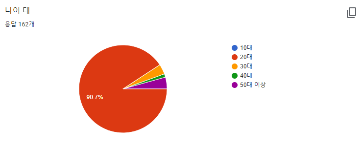
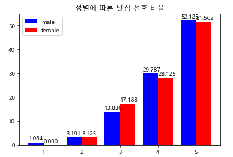
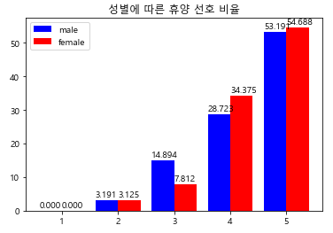
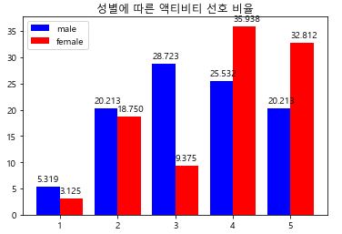
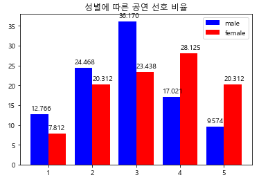

# Travel_Together
## 1. 개요
해당 프로젝트는 2021학년도 2학기부터 실시되는 인천대학교 컴퓨터공학부 캡스톤디자인에 해당하는 프로젝트로 최종 결과물은 2022학년도 1학기 실시되는 졸업작품 발표회에 출품 될 예정입니다.  
초보 여행자를 타겟으로한 T.T(Travel Together)라는 안드로이드 어플리케이션을 제작할 계획입니다.  
이후 문서는 해당 프로젝트를 진행하는 동안의 기획/개발 과정에 대해 서술할 것입니다.  
### 1.1 사용 프로그램 및 언어
Client: Android Studio, Kotlin  
Server: node.js, AWS  
DB: MySQL  
Data: Python, Anaconda3, TensorFlow, TensorFlow Lite  
 
## 2. 진행 과정
### 2.1 기획과정(회의요약)   
09/05 ~ 09/11: 최초 아이디어 회의. 안드로이드 어플리케이션을 메인으로한 프로젝트 구상.   
09/14 ~ 09/30: 많은 아이디어 중 3가지를 추려 발표. 메인 아이디어는 교수님 피드백 이후 확정.   
10/14: 식단/교육/여행 세 가지 대주제 중 여행아이디어가 가장 경쟁력있다 피드백. 여행을 주제로 확정.   
10/19: 여행 app에 필요한 지도 API(네이버/카카오/구글) 조사 및 비교. 데이터 분석 관련 논문 조사.   
10/29: 발표 준비. 확정된 캡스톤 주제, 비슷한 사용층을 갖고 있는 제품 조사. 팀원 역할 분배.   
11/03: 차별점 구상.   
11/11: 발표 준비. 아이디어 구체화 및 개발 방향 잡기.   
11/14 ~ 12/08: 최종 발표 준비.
12/20 ~ 12/22: 설문조사 항목 완성 및 배포  
12/22 ~ 22/01/01: 실제 개발 전 API/DB/Data/Sever 플랫폼 및 개발 도구 선정  
AWS/UI Tool/Google Maps
 
### 2.2 개발과정
01/02 ~ 01/16: 관광지 API데이터 DB에 저장/모델 Input data(tensor) 규격 확정/DB Table 구축/Google Maps API 적용/node.js 사용해 통신서버 구축  
01/19 ~ 01/30: 데이터 정형화 완료/App - DB 통신 확인/게시판 구현/App 내 화면 전환을 Fragment(hide/show)를 통해 개발  
02/06 ~ 02/19: 데이터 모델 튜닝/TensorFlow Lite(TFLite) 모델로 변환/여행지 간 경로 추적 알고리즘 적용
02/19 ~ 02/26: TFLite 테스트/댓글 기능 구현/스케쥴 관리 구현
## 3. 데이터 셋 구축
<https://forms.gle/4Da2Lvkz6UBcEf2E8>   
해당 설문조사지를 통해 유저의 취향과 관광지 간의 연결성을 찾으려고 합니다.  
해당 설문은 약 160여 명의 분들이 21/12/22~22/01/13의 기간 동안 참가해주셨습니다.  
Data Directory의 data_visualization 파일의 경우 설문조사 결과를 구글에서 지원해주는   
기본적인 분류가 아닌 프로젝트에서 필요한 분류로 재 편성해 이를 간단히 시각화 했습니다.   
우선 구글에서 기본적으로 지원해주는 각 항목에 대한 시각화 내용 중,   

이와 같이 설문 표본 집단이 대부분 20대로 구성되어 나이라는 요소는 범주를 설정하는데 있어 유의미한 지표가 되지 않겠다고 판단했습니다.  
하지만 기본 지원되는 내용 중에 상위 항목의 선택에 따른 선택지의   
비율을 나타내 주지는 않아 "성별"이라는 요소가 판단할 요소가 되는 지에 대한 구체적인 자료가 필요했습니다.  
   
위의 두 카테고리는 성별에 따라 큰 차이를 보이진 않았습니다만,   
  
이 지표 들은 차이를 보여줌으로서 "성별"이라는 지표가 저희 프로젝트에 효용성이 있다고 판단했습니다.  
이와 동시에 "맛집"이라는 카테고리는 비 선호 비율이 너무 적어 지표로 쓰기에 어렵다고 판단해 러닝 모델을 학습시키는 요소에서 제외시켰습니다.
